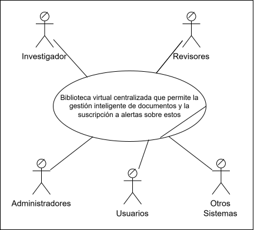

# Core del Negocio — Caso de Uso de Alto Nivel

> El core resume el objetivo principal del sistema en un solo caso de uso. Es la vista de caja negra: muestra quien interactua con el sistema y que se espera de el, sin entrar en detalles internos.

Diagrama de core del negocio

# Descripcion del core

Una plataforma centralizada que permite la gestión inteligente de 
documentos académicos y técnicos con capacidades de búsqueda semántica, métricas de impacto, sistema de suscripciones y alertas automáticas que notifica proactivamente a usuarios sobre nuevas publicaciones relevantes según sus intereses.

---

Draw.io: [[LINK_DRAWIO](https://drive.google.com/file/d/1efYOoJKz-nXQjA61oFqORasdimOEUhW2/view?usp=sharing)]