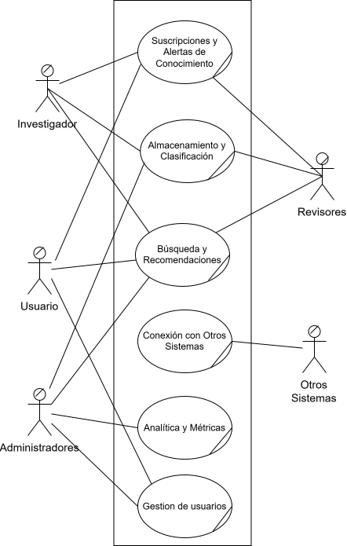

# Primera Descomposicion del Core

> La primera descomposicion transforma el core en procesos generales del negocio; cada proceso debe representar un flujo completo con un resultado de valor. 

 Diagrama de la primera descomposición del negocio de alto nivel.
 
 

---

Draw.io: [[LINK_DRAWIO](https://drive.google.com/file/d/1efYOoJKz-nXQjA61oFqORasdimOEUhW2/view?usp=sharing)]