# **Ejemplo del CUN-Cora hasta los Requerimientos**

> Este documento corresponde al ejemplo del recorrido desde el core del negocio hasta los requerimientos y las matrices de trazabilidad.
>
> Se conservaron el código PlantUML y las imágenes exportadas de los diagramas. Las imágenes permiten visualizar el material directamente en Visual Studio Code, donde PlantUML no se renderiza de forma predeterminada sin una extensión o herramienta compatible.
>
> El código fuente puede reutilizarse para modificar los diagramas o proporcionarse a una herramienta de inteligencia artificial para solicitar apoyo en el análisis del modelo. Las sugerencias deben revisarse y validarse con el negocio y los stakeholders.
> 
> **Enlaces de referencia:**
> 
> - [Versión interactiva del ejemplo en HackMD](https://hackmd.io/@H6I0U4DZRa2zb-9NP0DxaQ/HJsX7A2t-x)

---

# Core del Negocio y Primera Descomposición

## **Identificación del Core del Negocio**

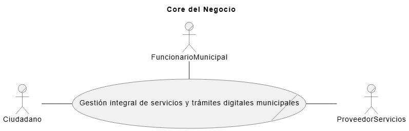

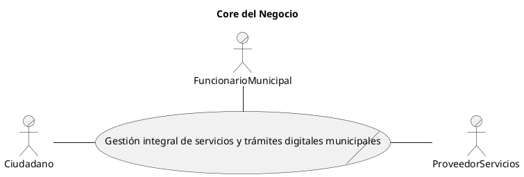

---

### **Descripción formal del Core**

El core del negocio consiste en centralizar, digitalizar y estandarizar los procesos mediante los cuales los gobiernos locales prestan servicios a los ciudadanos, garantizando acceso electrónico a trámites, pagos, información pública y mecanismos de participación ciudadana. Permitiendo que los municipios ofrezcan servicios de gobierno electrónico de forma continua, segura y accesible, reduciendo la dependencia de procesos presenciales y fortaleciendo la transparencia, eficiencia administrativa y la interacción del ciudadano con el municipio. 

---

## **Identificación de Procesos de Negocio (Primera Descomposición)**

### **Procesos del negocio**

1. **Gestionar trámites municipales digitales**
2. **Gestionar pagos y recaudación municipal**
3. **Gestionar información pública y transparencia**
4. **Gestionar participación ciudadana**
5. **Gestionar atención y comunicación con el ciudadano**

## Primera Descomposición

### **CDU de Negocio – Primera Descomposición**

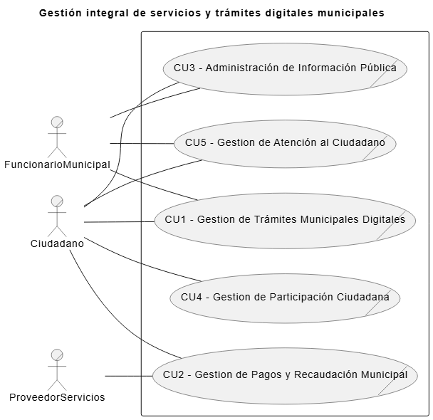

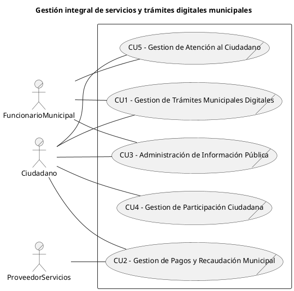
---

# **Tabla de Stakeholders**

| **Nombre**                         | **Descripción**                                      | **Responsabilidades**                                                                                                     |
| ---------------------------------- | ---------------------------------------------------- | ------------------------------------------------------------------------------------------------------------------------- |
| **Director de Gobierno Digital**   | Dueño del sistema a nivel institucional              | Aprobar la visión y alcance del sistema. Autorizar el despliegue en municipios. Aprobar entregables estratégicos.   |
| **Ciudadano**                      | Usuario final de los servicios digitales municipales | Utilizar trámites, pagos y servicios digitales. Participar en mecanismos ciudadanos. Consultar información pública. |
| **Funcionario Municipal**          | Usuario interno del municipio                        | Gestionar trámites y solicitudes. Publicar información pública. Atender requerimientos ciudadanos.                  |
| **Administrador del Sistema**      | Responsable de la administración operativa           | Configurar usuarios y roles. Monitorear operación del sistema. Gestionar incidencias.                               |
| **Proveedor de Servicios de Pago** | Tercero externo                                      | Procesar pagos electrónicos. Garantizar disponibilidad del servicio de pago (Banco).                                           |
| **Equipo de Infraestructura**      | Soporte técnico                                      | Proveer infraestructura y conectividad. Asegurar disponibilidad y respaldo (Tier II).                                            |
| **Líder del Proyecto**             | Coordinador del desarrollo                           | Planificar y coordinar el proyecto. Representar al equipo técnico. Asegurar cumplimiento de objetivos.              |

---

# **Tabla de Objetivos de Negocio (ON)**

| **ID**    | **Descripción del objetivo de negocio**                                                                                   |
| --------- | ------------------------------------------------------------------------------------------------------------------------- |
| **ON-01** | Digitalizar y centralizar los servicios municipales para mejorar el acceso del ciudadano a trámites y servicios públicos. |
| **ON-02** | Incrementar la eficiencia administrativa reduciendo tiempos y costos operativos en los municipios.                        |
| **ON-03** | Fortalecer la transparencia y el acceso a la información pública municipal.                                               |
| **ON-04** | Promover la participación ciudadana en la gestión municipal mediante canales digitales.                                   |
| **ON-05** | Garantizar la continuidad y disponibilidad de los servicios digitales municipales a nivel nacional.                       |
| **ON-06** | Incrementar la adopción municipal en al menos 40% en 12 meses mediante la activación de trámites esenciales en la Plataforma GLD bajo un modelo SaaS.                       |

---

# **Tabla de Características del Negocio / Sistema (CAR)**

| **ID**     | **Descripción**                                                                  | **Prioridad** | **Objetivo de negocio asociado** |
| ---------- | -------------------------------------------------------------------------------- | ------------- | -------------------------------- |
| **CAR-01** | El sistema debe permitir realizar trámites municipales de forma digital.         | Alta          | ON-01                            |
| **CAR-02** | El sistema debe permitir la gestión de pagos electrónicos municipales.           | Alta          | ON-01                            |
| **CAR-03** | El sistema debe permitir la publicación y consulta de información pública.       | Alta          | ON-03                            |
| **CAR-04** | El sistema debe habilitar mecanismos de participación ciudadana digital.         | Media         | ON-04                            |
| **CAR-05** | El sistema debe garantizar disponibilidad continua de los servicios digitales.   | Alta          | ON-05                            |
| **CAR-06** | El sistema debe proteger la información y datos de los ciudadanos.               | Alta          | ON-05                            |
| **CAR-07** | El sistema debe integrarse con servicios externos (pagos, notificaciones, etc.). | Media         | ON-02                            |
| **CAR-08** | El sistema debe ser fácil de utilizar para propiciar su adopción.                | Alta          | ON-06                            |

---

# **CDU EXPANDIDOS**

## **CU1 - Gestion de Trámites Municipales Digitales**

Este proceso de negocio se encarga de digitalizar, administrar y ejecutar los trámites municipales que tradicionalmente se realizan de forma presencial. Incluye la recepción de solicitudes ciudadanas, la validación de requisitos, el seguimiento del estado del trámite y la notificación de resultados. 

Permite al ciudadano iniciar, consultar y finalizar trámites administrativos como licencias, permisos, constancias, solicitudes de servicios y otros procedimientos oficiales, garantizando trazabilidad, reducción de tiempos de atención y eliminación de barreras físicas. Asimismo, habilita a los funcionarios municipales para revisar, aprobar, rechazar o solicitar información adicional, asegurando el cumplimiento normativo y la estandarización de procesos entre distintos municipios.

### **CDU Expandidos identificados**

* CU1-1 Gestionar Solicitudes de Trámites
* CU1-2 Validar Requisitos del Trámite
* CU1-3 Resolver Trámite Municipal
* CU1-4 Notificar Estado del Trámite
* CU1-5 Administrar Catálogo de Trámites

### **Trazabilidad**

* ON-01
* CAR-01, CAR-06

---

### **Diagrama CDU Expandido – CU1**

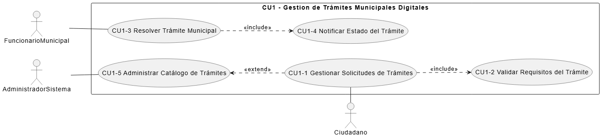

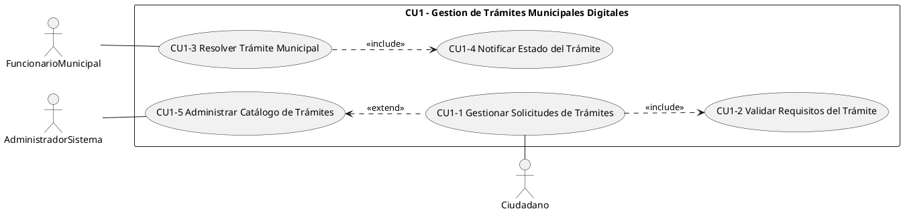

---

## **CU2 - Gestion de Pagos y Recaudación Municipal**

Este proceso de negocio gestiona la recaudación de ingresos municipales asociados a servicios, trámites y obligaciones fiscales, permitiendo a los ciudadanos realizar pagos de forma electrónica. 

Abarca el cálculo de montos, la generación de comprobantes, la ejecución de pagos y la confirmación de transacciones. También incluye la conciliación de pagos, la emisión de recibos oficiales y el registro de ingresos para control financiero municipal. Este proceso garantiza transparencia en la recaudación, reduce el manejo de efectivo y facilita la integración con entidades financieras y proveedores de pago, asegurando que los ingresos municipales sean administrados de manera eficiente y confiable.

### **CDU Expandidos identificados**

* CU2-1 Gestionar Obligaciones de Pago
* CU2-2 Procesar Pago Electrónico
* CU2-3 Confirmar Transacción
* CU2-4 Integrar Proveedores de Pago

### **Trazabilidad**

* ON-01, ON-02
* CAR-02, CAR-07

---

### **Diagrama CDU Expandido – CU2**

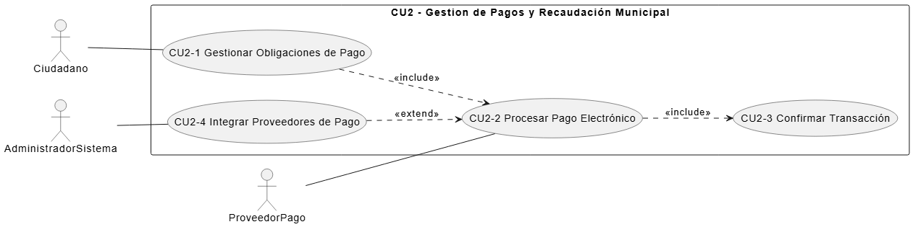

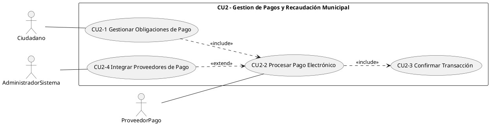

---

## **CU3 - Administración de Información Pública**

Este proceso de negocio permite publicar, mantener y consultar información pública municipal, en cumplimiento con las leyes de acceso a la información. Incluye la divulgación de presupuestos, proyectos, normativas, actas, informes de gestión y otros datos relevantes para la ciudadanía. 

Facilita que los ciudadanos accedan a información actualizada y confiable, fortaleciendo la rendición de cuentas y la confianza en la administración pública. Asimismo, permite a los funcionarios municipales cargar, actualizar y organizar la información oficial, asegurando consistencia, vigencia y disponibilidad continua de los datos publicados.

### **CDU Expandidos identificados**

* CU3-1 Publicar Información Pública
* CU3-2 Actualizar Información Institucional
* CU3-3 Consultar Información Pública

### **Trazabilidad**

* ON-03
* CAR-03

---

### **Diagrama CDU Expandido – CU3**

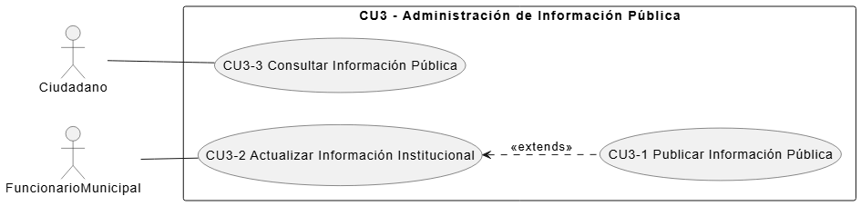

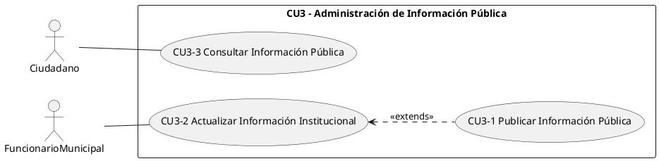

---

## **CU4 - Gestion de Participación Ciudadana**

Este proceso de negocio habilita mecanismos de interacción activa entre la ciudadanía y el gobierno municipal, fomentando la participación democrática en la gestión pública. Incluye la recepción de opiniones, propuestas, denuncias, consultas y participación en encuestas, foros o procesos de votación ciudadana. 

Permite que los ciudadanos expresen necesidades y contribuyan a la toma de decisiones locales, mientras que los funcionarios municipales pueden analizar, responder y dar seguimiento a dichas interacciones. Este proceso fortalece la inclusión, la transparencia y la colaboración entre el municipio y la comunidad.

### **CDU Expandidos identificados**

* CU4-1 Registrar Participación Ciudadana
* CU4-2 Gestionar Consultas y Opiniones
* CU4-3 Analizar Participación Ciudadana

### **Trazabilidad**

* ON-04
* CAR-04

---

### **Diagrama CDU Expandido – CU4**

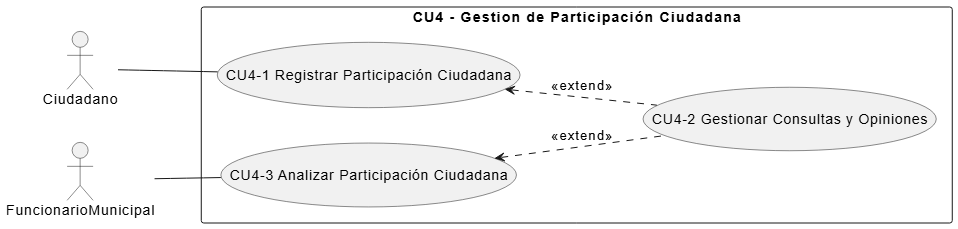

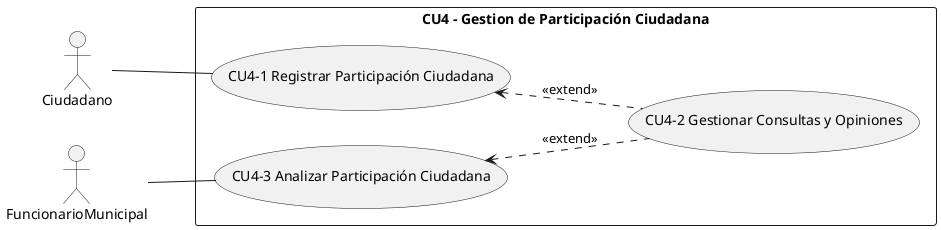

---

## **CU5 - Gestión de Atención al Ciudadano**

Este proceso de negocio se orienta a centralizar y gestionar la comunicación entre el municipio y los ciudadanos, proporcionando canales de atención digital. Incluye la gestión de consultas, quejas, solicitudes de información y notificaciones oficiales. 

Permite dar seguimiento a casos de atención ciudadana, asignarlos a las áreas correspondientes y comunicar respuestas. Además, facilita la difusión de avisos, alertas y comunicados municipales. Este proceso mejora la calidad del servicio público y la percepción ciudadana sobre la gestión municipal.

### **CDU Expandidos identificados**

* CU5-1 Registrar Solicitudes Ciudadanas
* CU5-2 Dar Seguimiento a Solicitudes
* CU5-3 Notificar Respuesta al Ciudadano

### **Trazabilidad**

* ON-02
* CAR-05
* CAR-08

---

### **Diagrama CDU Expandido – CU5**

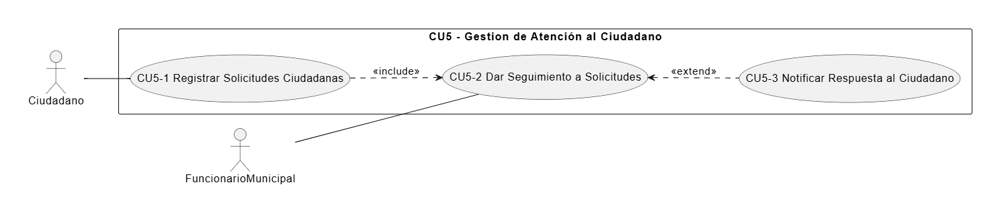

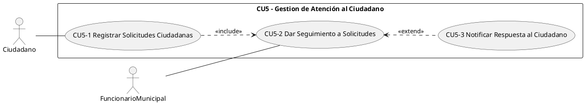

---

# **Drivers Funcionales (RF)**

## Caso: *Gobiernos Locales Digitales (GLD)*

---

## **RF derivados de CU1**

| **ID**    | **Descripción del Driver Funcional**                                                           | **CU Expandido origen** | **CAR asociada** | **ON asociada** |
| --------- | ---------------------------------------------------------------------------------------------- | ----------------------- | ---------------- | --------------- |
| **RF-01** | Permite al ciudadano registrar solicitudes de trámites municipales de forma digital.           | CU1-1                   | CAR-01           | ON-01           |
| **RF-02** | Permite validar automáticamente y manualmente los requisitos asociados a un trámite municipal. | CU1-2                   | CAR-01, CAR-06   | ON-01           |
| **RF-03** | Permite a los funcionarios municipales resolver, aprobar o rechazar trámites digitales.        | CU1-3                   | CAR-01           | ON-02           |
| **RF-04** | Permite notificar al ciudadano el estado y resultado de sus trámites municipales.              | CU1-4                   | CAR-05           | ON-02           |
| **RF-05** | Permite administrar y mantener el catálogo de trámites municipales disponibles.                | CU1-5                   | CAR-08           | ON-02           |

---

## **RF derivados de CU2**

| **ID**    | **Descripción del Driver Funcional**                                                 | **CU Expandido origen** | **CAR asociada** | **ON asociada** |
| --------- | ------------------------------------------------------------------------------------ | ----------------------- | ---------------- | --------------- |
| **RF-06** | Permite gestionar obligaciones de pago asociadas a trámites y servicios municipales. | CU2-1                   | CAR-02           | ON-01           |
| **RF-07** | Permite procesar pagos electrónicos municipales mediante proveedores externos.       | CU2-2                   | CAR-02, CAR-07   | ON-01           |
| **RF-08** | Permite confirmar y registrar transacciones de pago realizadas exitosamente.         | CU2-3                   | CAR-02           | ON-02           |
| **RF-09** | Permite integrar y configurar proveedores externos de pago electrónico.              | CU2-4                   | CAR-07           | ON-02           |

---

## **RF derivados de CU3**

| **ID**    | **Descripción del Driver Funcional**                                          | **CU Expandido origen** | **CAR asociada** | **ON asociada** |
| --------- | ----------------------------------------------------------------------------- | ----------------------- | ---------------- | --------------- |
| **RF-10** | Permite publicar información pública municipal de manera digital y accesible. | CU3-1                   | CAR-03           | ON-03           |
| **RF-11** | Permite actualizar y mantener vigente la información institucional publicada. | CU3-2                   | CAR-03           | ON-03           |
| **RF-12** | Permite a los ciudadanos consultar información pública municipal.             | CU3-3                   | CAR-03           | ON-03           |

---

## **RF derivados de CU4**

| **ID**    | **Descripción del Driver Funcional**                                                         | **CU Expandido origen** | **CAR asociada** | **ON asociada** |
| --------- | -------------------------------------------------------------------------------------------- | ----------------------- | ---------------- | --------------- |
| **RF-13** | Permite registrar la participación ciudadana en consultas, encuestas o mecanismos digitales. | CU4-1                   | CAR-04           | ON-04           |
| **RF-14** | Permite gestionar y dar seguimiento a opiniones y consultas ciudadanas.                      | CU4-2                   | CAR-04           | ON-04           |
| **RF-15** | Permite analizar la información generada por la participación ciudadana.                     | CU4-3                   | CAR-04           | ON-04           |

---

## **RF derivados de CU5**

| **ID**    | **Descripción del Driver Funcional**                                                    | **CU Expandido origen** | **CAR asociada** | **ON asociada** |
| --------- | --------------------------------------------------------------------------------------- | ----------------------- | ---------------- | --------------- |
| **RF-16** | Permite registrar solicitudes, consultas y reclamos de los ciudadanos.                  | CU5-1                   | CAR-05, CAR-08           | ON-02           |
| **RF-17** | Permite dar seguimiento y gestionar la atención de solicitudes ciudadanas.              | CU5-2                   | CAR-05           | ON-02           |
| **RF-18** | Permite notificar al ciudadano las respuestas y comunicaciones oficiales del municipio. | CU5-3                   | CAR-05           | ON-02           |

---

# **Drivers de Atributos de Calidad (EAC)**
## **EAC-01 — Desempeño**

| Campo                                     | Descripción                                                                             |
| ----------------------------------------- | --------------------------------------------------------------------------------------- |
| **Escenario crudo**                       | Un ciudadano consulta y registra un trámite municipal durante la hora pico de atención. |
| **Objetivos de negocio correspondientes** | **CU1-1, CU1-2** (Gestionar solicitudes y validar requisitos)                           |
| **Atributos de calidad relevantes**       | Desempeño                                                                               |
| **Estímulo**                              | Solicitud y consulta de trámite municipal                                               |
| **Fuente de estímulo**                    | Ciudadano                                                                               |
| **Entorno**                               | Operación normal del sistema con alta concurrencia ciudadana                            |
| **Artefacto (si se conoce)**              | Módulo de gestión de trámites                                                           |
| **Respuesta**                             | El sistema procesa la solicitud y muestra el estado del trámite                         |
| **Medida de la respuesta**                | Tiempo de respuesta ≤ **2 segundos** en el 95% de las solicitudes                       |
| **Preguntas**                             | ¿Cuántos trámites simultáneos se consideran hora pico?                                  |
| **Problemas**                             | Saturación de solicitudes concurrentes                                                  |

---

## **EAC-02 — Disponibilidad**

| Campo                                     | Descripción                                                                    |
| ----------------------------------------- | ------------------------------------------------------------------------------ |
| **Escenario crudo**                       | Ocurre una falla en el servidor principal que aloja los servicios municipales. |
| **Objetivos de negocio correspondientes** | **CU2-2, CU2-3** (Procesar y confirmar pagos)                                  |
| **Atributos de calidad relevantes**       | Disponibilidad                                                                 |
| **Estímulo**                              | Falla del servidor principal                                                   |
| **Fuente de estímulo**                    | Infraestructura                                                                |
| **Entorno**                               | Operación normal del sistema                                                   |
| **Artefacto (si se conoce)**              | Plataforma de servicios municipales                                            |
| **Respuesta**                             | El sistema conmuta a un servidor alterno y continúa operando                   |
| **Medida de la respuesta**                | Recuperación ≤ **3 minutos**, sin pérdida de datos confirmados                 |
| **Preguntas**                             | ¿El cambio a standby es automático o asistido?                                 |
| **Problemas**                             | Dependencia de un único punto de falla                                         |

---

## **EAC-03 — Seguridad**

| Campo                                     | Descripción                                                               |
| ----------------------------------------- | ------------------------------------------------------------------------- |
| **Escenario crudo**                       | Un tercero intenta interceptar la comunicación durante un pago municipal. |
| **Objetivos de negocio correspondientes** | **CU2-2** (Procesar pago electrónico)                                     |
| **Atributos de calidad relevantes**       | Seguridad                                                                 |
| **Estímulo**                              | Intento de interceptación de datos                                        |
| **Fuente de estímulo**                    | Atacante externo                                                          |
| **Entorno**                               | Operación normal                                                          |
| **Artefacto (si se conoce)**              | Módulo de pagos electrónicos                                              |
| **Respuesta**                             | Los datos transmitidos no pueden ser interpretados                        |
| **Medida de la respuesta**                | 100% de la información transmitida cifrada                                |
| **Preguntas**                             | ¿Qué datos se consideran sensibles?                                       |
| **Problemas**                             | Riesgo de exposición de datos personales                                  |

---

## **EAC-04 — Usabilidad**

| Campo                                     | Descripción                                                     |
| ----------------------------------------- | --------------------------------------------------------------- |
| **Escenario crudo**                       | Un adulto mayor intenta registrar un trámite municipal digital. |
| **Objetivos de negocio correspondientes** | **CU1-1** (Gestionar solicitudes de trámites)                   |
| **Atributos de calidad relevantes**       | Usabilidad                                                      |
| **Estímulo**                              | Interacción del usuario con el formulario                       |
| **Fuente de estímulo**                    | Ciudadano adulto mayor                                          |
| **Entorno**                               | Operación normal                                                |
| **Artefacto (si se conoce)**              | Interfaz de trámites municipales                                |
| **Respuesta**                             | El sistema guía al usuario y previene errores                   |
| **Medida de la respuesta**                | Registro del trámite en ≤ **4 interacciones**                   |
| **Preguntas**                             | ¿Se requiere accesibilidad adicional?                           |
| **Problemas**                             | Dificultad de uso para usuarios no técnicos                     |

---

## **EAC-05 — Modificabilidad / Interoperabilidad**

| Campo                                     | Descripción                                                             |
| ----------------------------------------- | ----------------------------------------------------------------------- |
| **Escenario crudo**                       | El municipio requiere integrar un nuevo proveedor externo de servicios. |
| **Objetivos de negocio correspondientes** | **CU2-4, CU5-2** (Integrar proveedores y seguimiento)                   |
| **Atributos de calidad relevantes**       | Modificabilidad                                                         |
| **Estímulo**                              | Solicitud de integración externa                                        |
| **Fuente de estímulo**                    | Administrador del sistema                                               |
| **Entorno**                               | Sistema en operación                                                    |
| **Artefacto (si se conoce)**              | Servicios de integración                                                |
| **Respuesta**                             | El sistema integra el nuevo proveedor sin afectar los existentes        |
| **Medida de la respuesta**                | Integración completada sin cambios estructurales                        |
| **Preguntas**                             | ¿Cuántos proveedores se esperan integrar?                               |
| **Problemas**                             | Rigidez del sistema ante cambios                                        |

---

## **EAC-06 — Usabilidad (Adopción del sistema)**
| Campo                                     | Descripción                                                                                                      |
| ----------------------------------------- | ---------------------------------------------------------------------------------------------------------------- |
| **Escenario crudo**                       | Un funcionario municipal utiliza por primera vez la plataforma digital para realizar sus tareas administrativas. |
| **Objetivos de negocio correspondientes** | **CU1-1, CU1-3, CU5-2**                                                                                          |
| **Atributos de calidad relevantes**       | **Usabilidad**                                                                                                   |
| **Estímulo**                              | Uso inicial de la plataforma por parte de un funcionario municipal                                               |
| **Fuente de estímulo**                    | Funcionario municipal                                                                                            |
| **Entorno**                               | Operación normal del sistema, durante la adopción inicial en un municipio                                        |
| **Artefacto (si se conoce)**              | Interfaz de usuario de la plataforma municipal                                                                   |
| **Respuesta**                             | El sistema permite completar las tareas principales sin requerir capacitación especializada                      |
| **Medida de la respuesta**                | El 90 % de los usuarios completa las tareas básicas en el primer intento, sin asistencia                         |
| **Preguntas**                             | ¿Qué tareas se consideran críticas para la adopción inicial?                                                     |
| **Problemas**                             | Resistencia al cambio y baja alfabetización digital                                                              |

---

# **Drivers de Restricción (DR)**

## **Tabla de Drivers de Restricción**

| **ID**    | **Tipo de Restricción**                                                 | **Descripción**                                                                                        |
| --------- | --------------------------------------------------------------- | ------------------------------------------------------------------------------------------------------------------------ |
| **DR-01** | **Cumplimiento Legal**          | Se debe cumplir con la legislación nacional de protección de datos personales y acceso a la información pública. |
| **DR-02** | **Adaptabilidad Institucional Multimunicipal**                  | Se debe poder ser utilizado por múltiples municipios con distintos niveles de madurez tecnológica.               |
| **DR-03** | **Alineamiento con Infraestructura Gubernamental**              | Se debe operar sobre infraestructura provista o autorizada por el gobierno central.                              |
| **DR-04** | **Integración con Ecosistema Digital del Estado**               | Se debe integrarse con plataformas externas existentes (pagos, notificaciones, registros nacionales).            |
| **DR-05** | **Control de Acceso y Gobierno de Identidades Institucionales** | El acceso al sistema debe estar controlado mediante roles institucionales definidos.                                     |
| **DR-06** | **Sostenibilidad Económica del Sistema**                        | Se debe minimizar costos de operación y mantenimiento a largo plazo.                                             |
| **DR-07** | **Continuidad Operativa**            | Se debe operar de forma continua, incluso ante fallas parciales de infraestructura.                              |
| **DR-08** | **Experiencia de Usuario Accesible**            | Se debe ser accesible para ciudadanos con distintos niveles de alfabetización digital.                           |
| **DR-09** | **Evolución Funcional**             | Se debe permitir incorporar nuevos servicios municipales sin rediseños completos.                                |

---

##  Trazabilidad de los Drivers de Restricción

| **Driver de Restricción** | **Impacta directamente en**                 |
| ------------------------- | ------------------------------------------- |
| DR-01                     | EAC-03 (Seguridad), EAC-02 (Disponibilidad) |
| DR-02                     | Arquitectura modular, CDU multi-municipio   |
| DR-03                     | Diagrama de despliegue                      |
| DR-04                     | RF-07, RF-09, EAC-05                        |
| DR-05                     | RF-02, RF-16, EAC-03                        |
| DR-06                     | Decisiones de infraestructura               |
| DR-07                     | EAC-02, Tema 4                              |
| DR-08                     | EAC-04                                      |
| DR-09                     | EAC-05, CDU expandidos                      |

---

## **Matriz Stakeholders vs Requerimientos (RF)**

Muestra qué stakeholders están directa o indirectamente interesados en cada requerimiento funcional, permitiendo verificar cobertura de actores y justificar la existencia de cada RF.

| Stakeholder \ RF                 | RF-01 | RF-02 | RF-03 | RF-04 | RF-05 | RF-06 | RF-07 | RF-08 | RF-09 | RF-10 | RF-11 | RF-12 | RF-13 | RF-14 | RF-15 | RF-16 | RF-17 | RF-18 |
| -------------------------------- | ----- | ----- | ----- | ----- | ----- | ----- | ----- | ----- | ----- | ----- | ----- | ----- | ----- | ----- | ----- | ----- | ----- | ----- |
| **Ciudadano**                    | X     | X     |       | X     |       | X     | X     | X     |       | X     |       | X     | X     | X     |       | X     | X     | X     |
| **Funcionario Municipal**        |       | X     | X     | X     | X     |       |       |       |       | X     | X     |       |       | X     | X     |       | X     |       |
| **Administrador del Sistema**    |       |       |       |       | X     |       |       |       | X     |       |       |       |       |       |       |       |       |       |
| **Proveedor de Pago**            |       |       |       |       |       |       | X     | X     | X     |       |       |       |       |       |       |       |       |       |
| **Director de Gobierno Digital** | X     | X     | X     | X     | X     | X     | X     | X     | X     | X     | X     | X     | X     | X     | X     | X     | X     | X     |

---

## **Matriz Requerimientos vs Casos de Uso**

Relaciona cada requerimiento funcional con los procesos de negocio (CUx-y) que lo originan, garantizando que todo RF tenga respaldo en un caso de uso expandido real.

| RF \ CUx-y | CU1-1 | CU1-2 | CU1-3 | CU1-4 | CU1-5 | CU2-1 | CU2-2 | CU2-3 | CU2-4 | CU3-1 | CU3-2 | CU3-3 | CU4-1 | CU4-2 | CU4-3 | CU5-1 | CU5-2 | CU5-3 |
| ---------- | ----- | ----- | ----- | ----- | ----- | ----- | ----- | ----- | ----- | ----- | ----- | ----- | ----- | ----- | ----- | ----- | ----- | ----- |
| **RF-01**  | X     |       |       |       |       |       |       |       |       |       |       |       |       |       |       |       |       |       |
| **RF-02**  |       | X     |       |       |       |       |       |       |       |       |       |       |       |       |       |       |       |       |
| **RF-03**  |       |       | X     |       |       |       |       |       |       |       |       |       |       |       |       |       |       |       |
| **RF-04**  |       |       |       | X     |       |       |       |       |       |       |       |       |       |       |       |       |       |       |
| **RF-05**  |       |       |       |       | X     |       |       |       |       |       |       |       |       |       |       |       |       |       |
| **RF-06**  |       |       |       |       |       | X     |       |       |       |       |       |       |       |       |       |       |       |       |
| **RF-07**  |       |       |       |       |       |       | X     |       |       |       |       |       |       |       |       |       |       |       |
| **RF-08**  |       |       |       |       |       |       |       | X     |       |       |       |       |       |       |       |       |       |       |
| **RF-09**  |       |       |       |       |       |       |       |       | X     |       |       |       |       |       |       |       |       |       |
| **RF-10**  |       |       |       |       |       |       |       |       |       | X     |       |       |       |       |       |       |       |       |
| **RF-11**  |       |       |       |       |       |       |       |       |       |       | X     |       |       |       |       |       |       |       |
| **RF-12**  |       |       |       |       |       |       |       |       |       |       |       | X     |       |       |       |       |       |       |
| **RF-13**  |       |       |       |       |       |       |       |       |       |       |       |       | X     |       |       |       |       |       |
| **RF-14**  |       |       |       |       |       |       |       |       |       |       |       |       |       | X     |       |       |       |       |
| **RF-15**  |       |       |       |       |       |       |       |       |       |       |       |       |       |       | X     |       |       |       |
| **RF-16**  |       |       |       |       |       |       |       |       |       |       |       |       |       |       |       | X     |       |       |
| **RF-17**  |       |       |       |       |       |       |       |       |       |       |       |       |       |       |       |       | X     |       |
| **RF-18**  |       |       |       |       |       |       |       |       |       |       |       |       |       |       |       |       |       | X     |

---

## **Matriz Stakeholders vs Casos de Uso**

Identifica qué stakeholders participan o interactúan con cada proceso de negocio (CUx-y), aclarando responsabilidades y roles.

| Stakeholder \ CUx-y              | CU1-1 | CU1-2 | CU1-3 | CU1-4 | CU1-5 | CU2-1 | CU2-2 | CU2-3 | CU2-4 | CU3-1 | CU3-2 | CU3-3 | CU4-1 | CU4-2 | CU4-3 | CU5-1 | CU5-2 | CU5-3 |
| -------------------------------- | ----- | ----- | ----- | ----- | ----- | ----- | ----- | ----- | ----- | ----- | ----- | ----- | ----- | ----- | ----- | ----- | ----- | ----- |
| **Ciudadano**                    | X     |       |       | X     |       | X     | X     | X     |       |       |       | X     | X     | X     |       | X     |       | X     |
| **Funcionario Municipal**        |       | X     | X     |       |       |       |       |       |       | X     | X     |       |       | X     | X     |       | X     |       |
| **Administrador del Sistema**    |       |       |       |       | X     |       |       |       | X     |       |       |       |       |       |       |       |       |       |
| **Proveedor de Pago**            |       |       |       |       |       |       | X     |       |       |       |       |       |       |       |       |       |       |       |
| **Director de Gobierno Digital** | X     | X     | X     | X     | X     | X     | X     | X     | X     | X     | X     | X     | X     | X     | X     | X     | X     | X     |

---

## **Matriz Requerimientos vs Requerimientos**

Muestra dependencias funcionales entre requerimientos, permitiendo analizar impacto de cambios y requerimientos transversales.

| RF ↓ \ RF → | RF-01 | RF-02 | RF-03 | RF-04 | RF-05 | RF-06 | RF-07 | RF-08 | RF-09 | RF-10 | RF-11 | RF-12 | RF-13 | RF-14 | RF-15 | RF-16 | RF-17 | RF-18 |
| ----------- | ----- | ----- | ----- | ----- | ----- | ----- | ----- | ----- | ----- | ----- | ----- | ----- | ----- | ----- | ----- | ----- | ----- | ----- |
| **RF-01**   |      | X     | X     | X     | X     |       |       |       |       |       |       |       |       |       |       |       |       |       |
| **RF-02**   | X     |      |       |       | X     |       |       |       |       |       |       |       |       |       |       |       |       |       |
| **RF-03**   | X     |       |      |       |       |       |       |       |       |       |       |       |       |       |       |       |       |       |
| **RF-04**   | X     |       |       |      |       |       |       |       |       |       |       |       |       |       |       |       |       |       |
| **RF-05**   | X     | X     |       |       |      |       |       |       |       |       |       |       |       |       |       |       |       |       |
| **RF-06**   |       |       |       |       |       |     | X     |       |       |       |       |       |       |       |       |       |       |       |
| **RF-07**   |       |       |       |       |       | X     |      | X     | X     |       |       |       |       |       |       |       |       |       |
| **RF-08**   |       |       |       |       |       |       | X     |      |       |       |       |       |       |       |       |       |       |       |
| **RF-09**   |       |       |       |       |       |       | X     |       |      |       |       |       |       |       |       |       |       |       |
| **RF-10**   |       |       |       |       |       |       |       |       |       |      | X     | X     |       |       |       |       |       |       |
| **RF-11**   |       |       |       |       |       |       |       |       |       | X     |      |       |       |       |       |       |       |       |
| **RF-12**   |       |       |       |       |       |       |       |       |       | X     |       |      |       |       |       |       |       |       |
| **RF-13**   |       |       |       |       |       |       |       |       |       |       |       |       |      | X     |       |       |       |       |
| **RF-14**   |       |       |       |       |       |       |       |       |       |       |       |       | X     |      | X     |       |       |       |
| **RF-15**   |       |       |       |       |       |       |       |       |       |       |       |       |       | X     |      |       |       |       |
| **RF-16**   |       |       |       |       |       |       |       |       |       |       |       |       |       |       |       |      | X     |       |
| **RF-17**   |       |       |       |       |       |       |       |       |       |       |       |       |       |       |       | X     |      | X     |
| **RF-18**   |       |       |       |       |       |       |       |       |       |       |       |       |       |       |       |       | X     |      |

---
